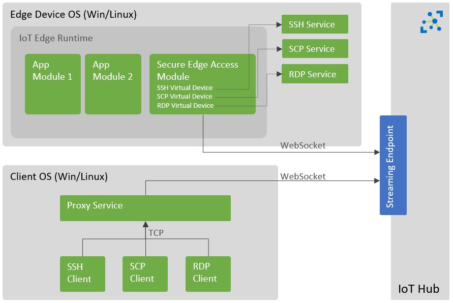

# IoT Edge Secure Remote Access 

Docker Containers (IoT Edge Module) Repo-
https://hub.docker.com/r/suneetnangia/azure-iot-edge-secure-access

This solution allows a secure remote access to your IoT Edge by leveraging [device stream](https://docs.microsoft.com/en-us/azure/iot-hub/iot-hub-device-streams-overview) feature of IoT Hub. 

The custom IoT Edge module in this solution run multiple IoT devices virtually on the edge which takes advantage of the security features of device stream. Both clients and Edge/Device makes outbound connection to the streaming endpoint of IoTHub, no inbound connection is made to either client or Edge/Device. 

Each virtual device is an IoT device in IoT Hub which makes an outbound connection securely to Iot Hub. Data is transferred on websockets using TCP as-is without any modification. Proxy service in the diagram below runs local to the clients and it's primary function is to authenticate against IoT Hub and broker TCP connections to websocket. A sample of this service is available [here](https://github.com/Azure-Samples/azure-iot-samples-csharp).

Solution is described in below-

Key Features-
1. JIT (Just in Time) Access.
2. Auditing.
3. Secure Access via Device Stream.

Surface Attack Area-
Surface attack area is greatly reduced by implementing this solution compared to opening a port on Edge device. In this instance access to your Edge device is delegated to IoT Hub which is a secure control plane managed in Azure via RBAC/MFA.
However, it is therefore even more important now to ensure you take care before granting service connect access permission to any clients, follow a principle of least prevlidge. Even if the service level access is compromised, user will need to supply credentials for the respective service (e.g. SSH) to connect to it.

Why hosting virtual devices in a module?
Hosting a device virtually in a module has some benefits which can be useful in edge scenarios.

1. You can host multiple virtual devices/protocols in a single module with lower resource (memory/cpu) footprint compared to hosting multiple modules one for each protocol (e.g. SSH, SCP, RDP).
2. You do not have to expose unbounded ports on the edge, each virtual device can be restricted to a specific port, mitigating the risk.
3. Each virtual device can be individually disconnected on-demand basis from IoT Hub to allow Just in Time (JIT) access.
4. Single management plane (IoT Hub) for access management.
5. Secure reverse connect mechanism underpinned by device stream feature.

#### Do not use this for application level connectivity which requires low latency and high throughputs, this is designed for on-demand/occasional access to the edge devices for debug or config reasons.

To learn more about device stream feature, see here-
https://docs.microsoft.com/en-us/azure/iot-hub/iot-hub-device-streams-overview
